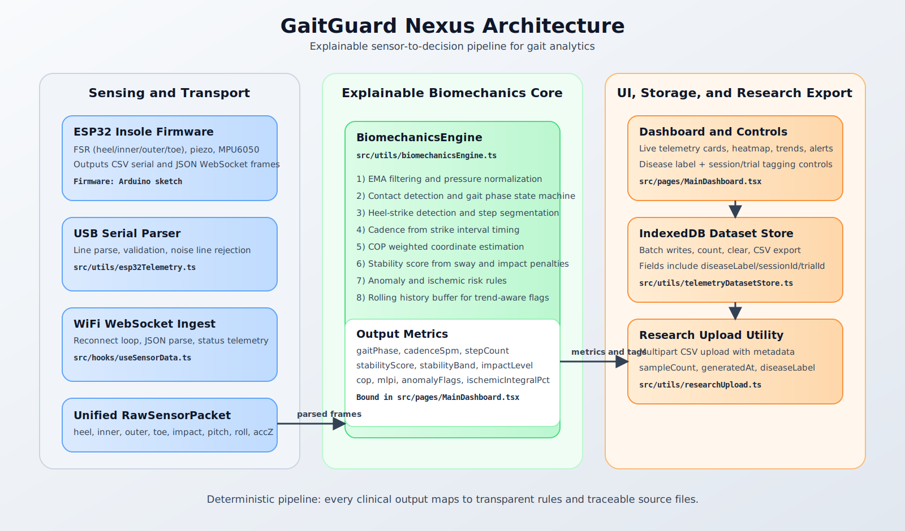

# GaitGuard Nexus (NIVA)

<p align="center">
  
</p>

<p align="center">
  
  
  
  
</p>

Deterministic, explainable gait analytics platform for ESP32 smart insole telemetry.

This project focuses on transparent biomechanics logic rather than black-box prediction. Every score and alert can be traced to explicit sensor rules.

## What This Project Does

- Streams plantar + IMU telemetry from ESP32 over USB Serial and WiFi WebSocket.
- Runs a real-time biomechanics engine for gait phase, cadence, COP, stability, and anomaly detection.
- Stores samples locally in IndexedDB with disease/session/trial metadata.
- Exports datasets as CSV and supports one-click backend upload for research pipelines.
- Supports disease-mode simulation for demos and algorithm walkthroughs.

## Explainability First

This is an explainable rule-based system. Core decisions are derived from explicit thresholds and state transitions:

- Contact detection from total normalized plantar pressure.
- Heel-strike events from impact + heel-rise transition constraints.
- Gait phase classification using interpretable phase rules.
- Cadence from heel-strike intervals.
- Stability from pitch/roll sway and impact penalties.
- Risk flags from sustained pressure and kinematic instability conditions.

Primary implementation file:

- src/utils/biomechanicsEngine.ts

## Data Pipeline

End-to-end flow:

ESP32 packet -> transport parsing -> biomechanics engine -> dashboard state -> dataset store -> CSV/export/upload

Coordinator file:

- src/pages/MainDashboard.tsx

## Architecture Diagram

<p align="center">
  
</p>

## Supported Input Formats

### USB Serial (CSV)

Expected line format:

```text
H,I,O,T,Piezo,Pitch,Roll,AccZ
```

Example:

```text
45,70,25,20,160,-2.1,1.4,9.78
```

### WiFi WebSocket (JSON)

Example payload:

```json
{"heel":42,"inner":68,"outer":31,"toe":27,"pitch":-2.4,"roll":1.3,"piezo":176,"accZ":9.72}
```

## Dataset Schema

Samples are persisted in browser IndexedDB.

- Database: gaitguard-nexus-datasets
- Store: esp32_samples

Per sample fields:

- timestampMs
- source (usb | ws | sim)
- sessionId
- trialId
- diseaseLabel (Unknown | Normal | Parkinson | Stroke | Neuropathy | Foot Drop | Ataxia)
- mode (live | simulation)
- heel
- inner
- outer
- toe
- impact
- pitch
- roll
- accZ

Disease labeling behavior:

- Live USB/WiFi packets use operator-selected disease label.
- Simulation packets auto-tag from active simulation mode.

## Backend Upload Contract

One-click upload sends multipart form-data with:

- file (CSV)
- sampleCount
- generatedAt
- datasetType (esp32-biomechanics)
- sessionId
- trialId
- diseaseLabel

Upload helper:

- src/utils/researchUpload.ts

## Quick Start

1. Install dependencies:

```bash
npm install
```

2. If peer dependency conflicts appear, use:

```bash
npm install --legacy-peer-deps
```

3. Start development server:

```bash
npm run dev
```

4. Open the app URL shown by Vite.

## Environment Variables

Create .env.local in project root if needed:

```bash
VITE_ESP32_WS_URL=ws://<esp32-ip>:81
VITE_DATASET_UPLOAD_URL=https://your-api.example.com/upload
VITE_DATASET_UPLOAD_TOKEN=your_optional_bearer_token
```

## Main Routes

- /main: live telemetry dashboard + simulation + dataset controls
- /settings: Nexus console, hardware matrix, raw WebSocket monitor
- /insights: clinical insights views
- /trends: trend analytics

Router definition:

- src/App.tsx

## Key Files

- src/pages/MainDashboard.tsx: transport integration, engine binding, dataset actions
- src/utils/biomechanicsEngine.ts: explainable gait algorithms
- src/utils/esp32Telemetry.ts: USB CSV parser
- src/hooks/useSensorData.ts: WebSocket hook with reconnect
- src/utils/telemetryDatasetStore.ts: IndexedDB and CSV export
- src/utils/researchUpload.ts: backend upload utility
- src/utils/simulationEngine.ts: synthetic disease-mode frame generator
- JUDGES_WALKTHROUGH.md: algorithm and data presentation script

## Scripts

- npm run dev: start local dev server
- npm run build: type-check and production build
- npm run preview: preview production build
- npm run lint: run ESLint

## Troubleshooting

- Web Serial requires Chromium-based browser and localhost/https context.
- Ensure ESP32 serial baud rate is 115200.
- If no live data appears, check cable quality and COM port permissions.
- If WiFi stream fails, verify VITE_ESP32_WS_URL and ESP32 WebSocket server port.

## Research and Clinical Notes

This repository currently provides an engineering prototype for explainable screening support and data collection. It is not a medical diagnosis device.

For judging and deep algorithm mapping, see:

- JUDGES_WALKTHROUGH.md
