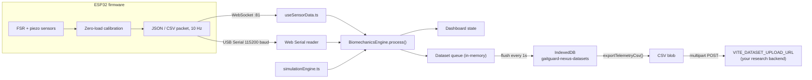

# Backend / Data Logic

There is no application server in this repo — "backend" here means three things: the **ESP32 firmware** producing data, the **browser-local dataset store** persisting it, and the **optional external upload** that ships a CSV export to a research API you provide. This doc covers all three plus the transport layer connecting them.



## 1. Firmware — the actual data source

Active sketch: `niva arduino/niva_hardware/niva_hardware.ino`

- **Pins**: heel `32`, inner `33`, outer `34`, toe `35`, piezo `36`, all analog, 12-bit ADC (`analogReadResolution(12)`, range 0–4095).
- **IMU**: MPU6050 on I2C (SDA 21, SCL 22) supplies live `pitch` / `roll` / `accZ`.
- **WiFi**: WiFiManager captive portal (`NIVA-GaitGuard-AP`), plus mDNS `ws://niva.local:81`.
- **Calibration**: 60-sample zero-load tare, persisted in NVS. Send `calibrate` / `tare` over WebSocket or Serial to re-tare.
- **Loop rate**: gated to `STREAM_INTERVAL_MS = 50` (20 Hz).
- **Output — both at once, every tick**:
  - **WebSocket** (`WebSocketsServer` on port `81`): JSON, e.g. `{"heel":12.00,"inner":8.00,"outer":3.00,"toe":1.00,"piezo":0.00,"pitch":-2.10,"roll":1.40,"accZ":9.78}`.
  - **USB Serial** (115200 baud): the same 8 values as a bare CSV line.

A smaller variant remains at `niva arduino/esp32_gaitguard_wifi_manager/esp32_gaitguard_wifi_manager.ino` (hardcoded Wi-Fi, no IMU/OLED, `pitch`/`roll`/`accZ` sent as `0.0`). Packet shape is the same.

## 2. Transport into the browser

Two independent paths feed the same downstream pipeline; only one is active at a time (checked via `isConnected`/`isSimulating` guards so they don't fight over the engine).

### 2a. USB Serial — `MainDashboard.tsx` (`connectSerial`/`disconnectSerial`)

- Uses the browser's **Web Serial API** (`navigator.serial`), which only exists in Chromium browsers over `localhost` or HTTPS — the dashboard checks for it (`isSerialSupported`) and shows a warning banner if unavailable.
- `port.open({ baudRate: 115200 })`, then pipes the raw byte stream through a `TextDecoderStream`, buffers partial lines, and splits on `\r?\n`.
- Each complete line goes through **`parseEsp32CsvLine`** (`src/utils/esp32Telemetry.ts`):
  ```ts
  const NON_DATA_PREFIXES = ['CALIBRATING', 'SYSTEM_', 'H,I,O,T'];
  ```
  Lines starting with these (firmware status/header lines) are ignored. Otherwise the line is split on `,`, requires **≥ 8 numeric fields**, and is destructured positionally: `heelRaw, mt1Raw, mt5Raw, toeRaw, piezoPeak, pitchDeg, rollDeg, accZ`. Anything that doesn't parse cleanly returns `null` and is silently dropped (no error surfaced per-line — only connection-level errors are shown).
- On disconnect, the reader is cancelled and its lock released defensively (both wrapped in empty `catch` blocks, since re-cancelling an already-closed stream throws) before the port itself is closed.

### 2b. WiFi WebSocket — `src/hooks/useSensorData.ts`

This hook resolves *which* URL to connect to and handles a browser-specific restriction the serial path doesn't have to deal with:

- **URL resolution priority**: `?esp32ws=` query param → `localStorage['gaitguard:nexus:ws-endpoint']` → `VITE_ESP32_WS_URL` env var → hardcoded fallback `ws://10.249.106.94:81`. Whichever wins is written back into `localStorage`, so opening a shared link once "pins" that device for future visits.
- **Local host detection**: if a hostname looks like an ESP32 AP/hotspot address (`localhost`, `127.0.0.1`, or RFC1918 private ranges `10.x`, `192.168.x`, `172.16–31.x`) and no port was specified, it defaults the port to `81`.
- **Mixed-content problem**: browsers refuse to open a plain `ws://` socket from a page served over `https://` (GitHub Pages is HTTPS). The hook detects this (`isBlockedByMixedContent`) and, if a **relay URL** is configured (`wss://...`, also resolvable from query param/localStorage/env), rewrites the connection to go through the relay instead, appending the real target as a query parameter (default key `target`, configurable via `VITE_ESP32_WS_RELAY_TARGET_KEY`). If no relay is configured, it surfaces a `connectionHint` telling the user to add one or use plain HTTP locally.
- **Reconnect**: on any socket close, a `1500ms` timer fires `connect()` again automatically, looping for as long as the component is mounted.
- **Malformed JSON** from the socket sets an error string rather than crashing.

Data lands in React state as `wsData`; `MainDashboard.tsx`'s `applyWsFrame` then normalizes field names (accepting either `inner`/`mt1` and `outer`/`mt5` as aliases, and either `impact`/`piezo`) before building the same `RawSensorPacket` shape the serial and simulation paths produce.

## 3. Processing — one engine, three sources

Regardless of source (`usb`, `ws`, or `sim`), every packet is funneled through **the same `BiomechanicsEngine` instance** (`biomechanicsRef.current.process(packet)`), so calibration state, step counting, and cadence timing stay consistent no matter where the data came from. This is deliberate: it's what lets the simulator's output be treated as "real" data for demo/training purposes.

## 4. On-device dataset store — `src/utils/telemetryDatasetStore.ts`

An IndexedDB database, `gaitguard-nexus-datasets` (version `2`), single object store `esp32_samples`, `keyPath: 'id'` with `autoIncrement`. Indexes on `timestampMs`, `source`, `sessionId`, `diseaseLabel`, `mode` (created idempotently in `onupgradeneeded`, so re-opening an older DB adds any indexes that are missing rather than failing).

Each row (`TelemetrySample`) carries: `timestampMs, source ('usb'|'ws'|'sim'), sessionId, trialId, diseaseLabel, mode ('live'|'simulation'), heel, inner, outer, toe, impact, pitch, roll, accZ`. `sessionId`/`trialId` fall back to `'session-unassigned'`/`'trial-001'` if left blank.

Exposed functions:
- `insertTelemetrySamples(samples[])` — batched `add()` calls inside one `readwrite` transaction.
- `getTelemetrySampleCount()` — `store.count()`.
- `getLatestTelemetrySamples(limit)` — walks the `timestampMs` index **backwards** (`direction: 'prev'`) collecting up to `limit` rows, then reverses the result so callers get oldest-first.
- `clearTelemetryDataset()` — wipes the store.
- `exportTelemetryCsv()` — pulls effectively all rows (`getLatestTelemetrySamples(1_000_000)`), builds a CSV with a fixed 14-column header, CSV-escaping any field containing a comma/quote/newline.

### Write path — queue, don't write per-packet

`MainDashboard.tsx` never calls `insertTelemetrySamples` directly from the hot path. Each processed packet is pushed onto an in-memory ref array (`datasetQueueRef`, via `enqueueDatasetSample`), and a **separate 1-second interval** (`flushDatasetQueue`) drains that queue into IndexedDB in one batch:

```ts
useEffect(() => {
  const intervalId = window.setInterval(() => void flushDatasetQueue(), 1000);
  return () => { window.clearInterval(intervalId); void flushDatasetQueue(); }; // flush once more on unmount
}, [flushDatasetQueue]);
```

- A `isFlushingDatasetRef` guard prevents overlapping flushes if a write is slow.
- **On failure, the batch is put back at the front of the queue** (`datasetQueueRef.current = [...batch, ...datasetQueueRef.current]`) so a transient IndexedDB error doesn't silently drop samples — they're retried on the next tick.
- At 10 Hz sampling this means up to ~10 samples can be buffered in memory before ever touching disk, trading a small durability window for far fewer IndexedDB transactions.

## 5. Export & upload — `src/utils/researchUpload.ts`

There is no bundled server — you point this at your own API via env vars (`.env.local`, Vite-style `VITE_*` prefix required to be exposed to the browser bundle):

```bash
VITE_DATASET_UPLOAD_URL=https://your-api.example.com/upload
VITE_DATASET_UPLOAD_TOKEN=your_optional_bearer_token
```

`uploadDatasetCsvToBackend({ csvContent, sampleCount, metadata })`:
1. Throws immediately if `VITE_DATASET_UPLOAD_URL` isn't set (checked client-side, before any network call).
2. Wraps the CSV string in a `Blob` (`text/csv;charset=utf-8;`) and builds `multipart/form-data`:
   - `file` — the CSV blob, named `gaitguard_esp32_dataset_<ISO timestamp with `:`/`.` replaced by `-`>.csv`
   - `sampleCount`, `generatedAt` (ISO timestamp), `datasetType: 'esp32-biomechanics'`
   - `sessionId`, `trialId`, `diseaseLabel` (only appended if present in `metadata`)
3. Adds `Authorization: Bearer <token>` if `VITE_DATASET_UPLOAD_TOKEN` is set.
4. `fetch(endpoint, { method: 'POST', body: formData, headers })`. Response body is parsed as JSON or text depending on `content-type`; a non-2xx status throws using the response body as the error message (or a generic fallback).
5. On success, returns `{ statusCode, message, location?, responseBody }` — `location` is pulled out of the JSON response body if the backend returns one (e.g. a URL to the stored file), otherwise `undefined`.

`MainDashboard.tsx`'s `handleUploadDataset` orchestrates the whole export-and-ship flow: force a `flushDatasetQueue()` first (so nothing in the in-memory queue is missed), re-check the sample count, build the CSV, then call the upload function — surfacing status text at each step (`"Flushing latest samples..."` → `"Preparing CSV..."` → `"Uploading..."` → `"Upload complete (...)"`).

**Manual CSV export** (`handleExportDataset`) is a separate, purely client-side path — no network call at all — that builds the same CSV via `exportTelemetryCsv()` and triggers a browser download via an `<a download>` + `Blob` object URL, so it works even with no upload endpoint configured.
